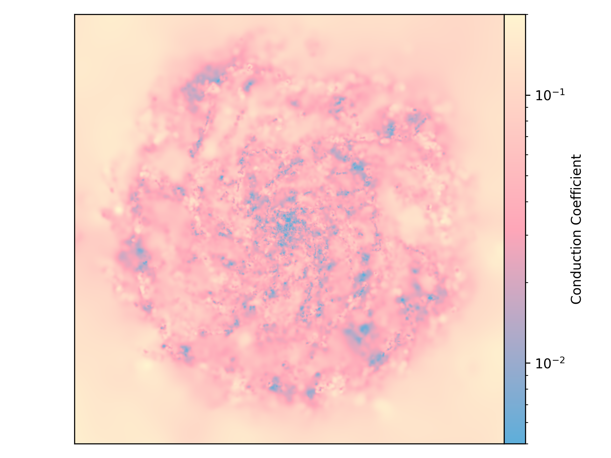

Taylor Swift color map collection.

Includes color maps based on the following albums:

+ Red (red, red_r)
+ 1989 (nineteen_eighty_nine, nineteen_eighty_nine_r)
+ Reputation (reputation, reputation_r)
+ Lover (lover, lover_r)
+ Folklore (folklore, folklore_r)

License: LGPLv3
Author: Josh Borrow (josh.borrow@gmail.com)

Usage
-----

To use these, you can import them and use them
with matplotlib as you would with any other color map.

```python
from swiftascmaps import red
from matplotlib.pyplot import imshow
from numpy import random

imshow(random.rand(128, 128), cmap=red)
```

Examples
--------

### Red


### 1989


### Reputation


### Lover



### Folklore


### Evermore


Note
----

Of course, these aren't necessarily designed to be colorblind
friendly, or perceptually uniform, so use them with caution.
They are quite pretty though.

